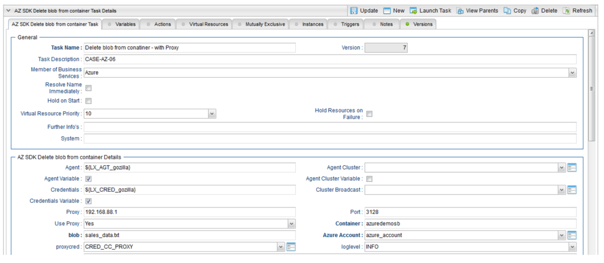

# ut-azure-blobstorage-monitor-blob-in-container-linux
# Abstract:

The here described Universal Tasks allow to Transfer and retrieve files from Azure Blob Storage in the Cloud. As a result, you can integrate any Azure Blob Storage file transfers into you existing or new scheduling workflows, providing a true hybrid cloud (on-premise and cloud computer) file transfer solution.

# 1	Disclaimer

No support and no warranty are provided by Stonebranch GmbH for this document and the related Universal Task. The use of this document and the related Universal Task is on your own risk.

Before using this task in a production system, please perform extensive testing.

Stonebranch GmbH assumes no liability for damage caused by the performance of the Universal Tasks

# 2	Scope

This document provides a documentation how to install and use the Universal Tasks for Azure Blob Storage File Transfers. If more Task will be created in the future this document will be updated accordingly.  

# 3	Introduction

Storing data in the cloud becomes an integral part of most modern IT landscapes. With Universal Automation Center you can securely automate your AWS, Azure or any other Cloud File Transfer and integrate them into your existing scheduling flows.

As security is one of the blob concerns, when moving to the cloud, the provided solution supports multi-level of security:
  - All Credential for Azure Blob Storage are stored in an encrypted form in the database
  - Connections towards the Azure Blob Storage via a Proxy Server are supported

The here described Series of Universal Tasks focuses on the Azure Blob Storage file transfer. A similar solution as for Azure is also available for Amazon S3 storage. 

Some details about the universal tasks for Azure Blob Storage:
  - The Universal Tasks are calling the Microsoft Azure Storage SDK for Python 
  - The python azure-storage-blob module is called by a Universal Agent running on a Linux Server or Windows Server – Note: This document focuses on the Linux Version 
  - The Server Running the Universal Agent needs to have Python 2.7.x or 3.6.x installed
  - All Universal Task support encrypted connections via a Proxy Server
  - All Credential for Azure (account_name, account_blob) are stored in an encrypted form in the database
  - You can configure all connection Parameters for the Proxy and Azure via the Universal Task
  - You can select different log-levels e.g. Info and debug
  
The following Universal Task for Azure Blob Storage have been implemented: 
  
   Image 1
      
   
 

# 4	Installation

# 4.1 Software Requirements

**Universal Task name:** ut-azure-blobstorage-monitor-blob-in-container-linux

**Related UAC XML Files for template and task:** Github repository

**Software used:** 

For the set-up you need:

1. Python 2.7.x (or 3.6.x) for Linux installed on a server where a Universal Agent is installed. 
2. For Python the following modules are required: 
	- Re, to support regular expression matching operations
	- glob, to find Unix pathnames matching a specified pattern
	- os, to support operating system dependent commands
	- sys, for output re-direct processing
	- datetime, date and time stamps for messages
	- logging, to provide logging capabilities for debug, info etc.
	- argparse, to allow testing of the Universal TPL. script on the command line
	- azure-storage-blob, The Azure libraries for Python to use Azure services and manage Azure resources
	- azure-storage-logging, provide enhanced logging for Azure storage services. Note: Only the module azure-storage-blob and azure-storage-logging need to be added to python 3.6.x. e.g. using pip.
	- pip install azure-storage-blob
	- pip install azure-storage-logging
3. Universal Controller 6.4.5.x or higher
4. Universal Agent 6.4.2.2 or higher installed on a Linux Server
5. An Azure account to try it out

# 4.2	Installation Steps
The following describes the installation steps:

**1.	Install Python 2.7.x or 3.6.x for Linux on the Universal Controller server or any Linux Server running a Universal Agent.**
Official Download link: 17TUhttps://www.python.org/downloads/U17T

Note: In most cases python is already available on Linux. Check availability with: python -V

**2.	17TAdd the azure-storage-blob and azure-storage-logging modules to your python installation**

In a command shell run as root or sudo:

	- pip install azure-storage-blob
	- pip install azure-storage-logging

**3.	Import each Azure Blob Storage Universal Task including the Universal Template to your Controller**

Go to “All Tasks” and load via the Import functionality the Universal Task configuration into the Controller. 

Image2

# 5	Universal Task Configuration
**1.	Activate: Resolvable Credentials in Universal Automation Center:**

Image3

**2.	Fill Out the Universal Task for each Azure Blob Storage command, which you want to execute:**

In the example below the Azure Create Container Task was selected

Image4

**Fill out or select the required Credentials for Azure and optionally a Proxy Server **

In the example below the azure_account credentials are shown:

Image5

# 6	Universal Tasks for Azure Blob Storage

The following chapter describes the provided Azure Blob Storage Universal Tasks.

# 6.1	Create_Container

Image6

**Task Screenshot:**

Image7

**Field Description**

Image8

Image8a

# 6.2	Monitor_blob_in_container

Image9

**Task Screenshot**

Image10

**Field Description**

Image11

# 6.3	Copy_file_to_container

Image12

**Task Screenshot**

Image13

**Field Description**

Image14

# 6.4	List_blobs_in_container

Image15

**Task Screenshot**

Image16

**Field Description**

Image17

# 6.5	Download_file_from_container

Image18

**Task Screenshot**

Image19

**Field Description**

Image20

# 6.6	Delete_blob_from_container

Image21

**Task Screenshot**

Image22

**Field Description**

Image23

# 6.7	Delete_empty_container

Image24

**Task Screenshot**

Image25

**Field Description**

Image26

# 6.8	List_containers

Image27

**Task Screenshot**

Image28

**Field Description**

Image29

# 6.9	Check_for_blob_in_containers

Image30

**Task Screenshot**

Image31

**Field Description**

Image32

# 7	Test Cases

The following basic test cases has been performed:

Image33

Image34

Image35

# 8	Document References
There are no document references.
